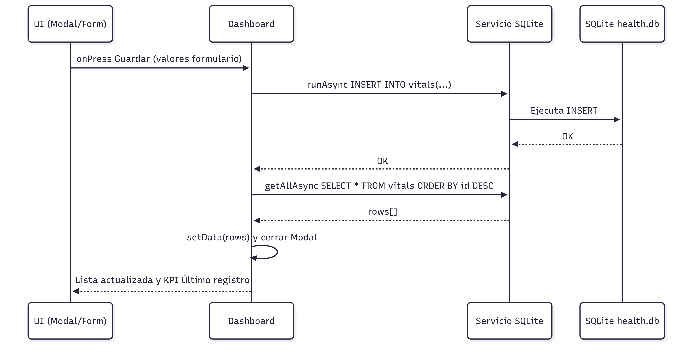

# Health Tracker RN – Diagramas

Este repositorio contiene diagramas para documentar la estructura de la base de datos y el flujo de operaciones principales de la aplicación **Health Tracker RN**.

---

## 📊 Diagrama de Base de Datos

Este diagrama muestra la estructura de la tabla `vitals`, utilizada para almacenar los signos vitales:

- **id**: clave primaria autoincremental
- **temperature_c**: temperatura en °C
- **systolic / diastolic**: presión arterial
- **heart_rate**: frecuencia cardiaca
- **notes**: notas opcionales
- **created_at**: fecha de creación en ISO-8601

## 🔄 Diagrama de Secuencia – Guardar Registro

Este diagrama describe el flujo cuando el usuario guarda un nuevo registro:

1. El usuario interactúa con la UI (Dashboard).
2. La UI llama al servicio de base de datos.
3. El servicio ejecuta la operación SQL en SQLite.
4. Con la respuesta, la UI actualiza el estado y refresca la lista.
